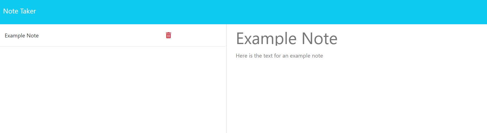

# studious-guacamole-module-11-challenge
Module 11 Challenge

## Description

This web application allows you to create notes that can be saved and viewed later.  You can created several notes that will be saved in a note list.  Any of your previous notes can be accessed and viewed from that list.

## Installation

N/A

## Usage

The application can be accessed at this URL: 

To add notes, type in a note title and note text in the appropriate fields.  Click on the save button to save the note.  The note will appear with its title in a list on the left side of the screen.  Click on the plus sign to create a new note.  You can access previous notes by clicking on the desired note on the left side of the screen.

Note taker screenshot:

## Credits

N/A

## License

N/A